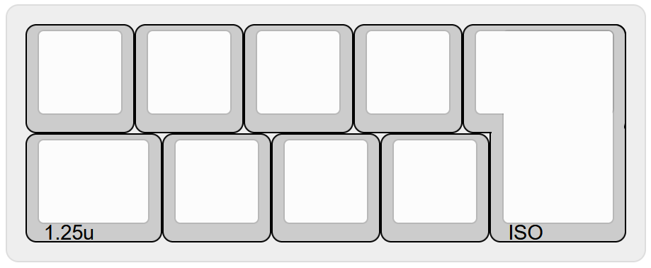
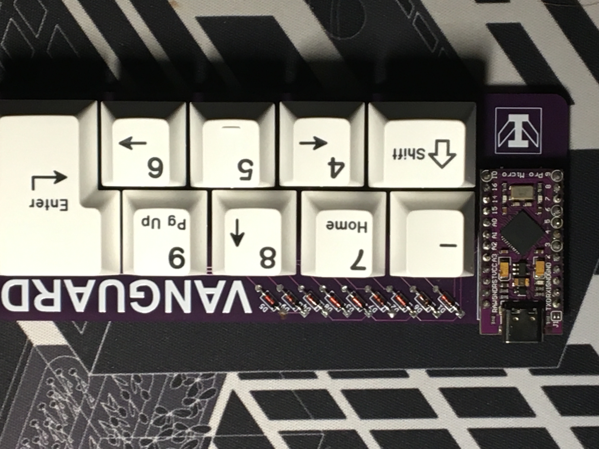

# VanguardMacropad
A nine key macropad, featuring an ISO enter key. This supports both MX and Alps switches (or clones of either), and runs QMK. The included firmware is for an Amtel ATmega32U4 based ProMicro, and while you could get it to work with any controler board with the same pins, you may need to rewrite the firmware yourself. USB C-C cables don't work for some reason, at least for me. Assembly assumes that you have some experience soldering (nothing difficult though, I was able to do it in about 20 minutes, having not soldered anything for years) and some basic knowledge about mechanical keyboards (nothing you can't easily find on YouTube or Reddit)

(built with Gateron G Pro Brown 2.0 switches and GMK Classic BOW)

# Shopping List
(this is probably the best list if you are in the UK, otherwise you can probably find similar things from local vendors if you are somewhere else.
- 1x ProMicro controller (or equivalent)- https://mechboards.co.uk/collections/controllers/products/pro-micro-5v
- 9x 1N4148 diodes- https://mechboards.co.uk/collections/diodes/products/throughhole-diodes
- 9x MX or Alps switches (or their clones)- https://www.serpentkeys.co.uk/collections/switches
- 1x 2U PCB mount stabiliser- https://keebcats.co.uk/products/durock-screw-in-stabilisers-v2-2u
- A set of compatible keycaps (you may want to use blank keycaps, relegendables, or something like GMK Dots that allows you to have keycaps that somewhat represent the macros you use)

# Assembly
- Order the PCBs from any PCB manufacturer using the production files, or generate your own using the KiCad documents included.
- Solder the pins for the ProMicro in first, then the THT Diodes, then the ProMicro, then the switches (the order doesn't matter too much, it's just easiest to do it in this order). Install the stabiliser for the ISO enter key. Install the keycaps.
- Connect the macropad to a computer that has QMK toolbox installed (download here: https://github.com/qmk/qmk_toolbox/releases).
- While Bridging the exposed pads on the back of the macropad (behind the ProMicro) or shorting the GND and RST pins on the ProMicro itself, flash the .hex file in the firmware folder to the Macropad. Note that this firmware is sort of just random bits of a numpad by default, you will probably want to change it yourself. This is easier said than done, when I tried to flash the firmware on it took about 10 tries (as well as some witchcraft!) to get my laptop to realise that the macropad did exist, but it worked in the end, so I had a moderately useless, but fully functional, half numpad until I had set up the firmware I actually wanted.
